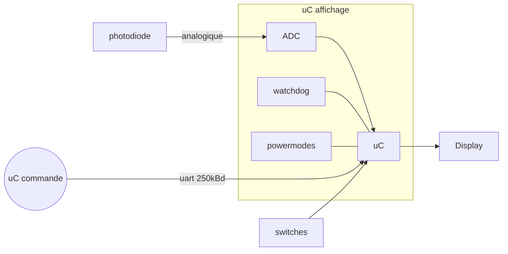

# Journal de développement réveil 
## Design général
L'objectif est de créer un affichage à fond arc-en-ciel flou (pas de palette prédéfinie) défilante diagonale, pour donner une esthétique similaire aux périphériques RGB.  
   
Ensuite, sur ce fond arc-en-ciel, l'idée est d'afficher l'heure de manière assez standard, soit en noir, soit en blanc, selon ce qui se voit le mieux et est le plus esthétique.
## Structure générale

## Driver affichage et gestion du canevas

### Journal de Développement - 02.10.2023

Aujourd'hui, j'ai passé une journée de travail intensive sur mon projet d'électronique, visant à créer un écran de réveil unique avec une matrice de LEDs WS2812B contrôlée par un STM32 Nucleo. Au cours de cette journée, j'ai exploré diverses idées et concepts pour concevoir un canevas d'affichage efficace et polyvalent, ainsi que pour superposer des chiffres sur un fond animé.

#### Choix de la Structure de Données du Canevas :

Pour représenter l'affichage entier, j'ai envisagé plusieurs approches, notamment un tableau en deux dimensions pour les pixels et un tableau en une dimension avec des coordonnées x et y pour chaque pixel. J'ai finalement opté pour un tableau en une dimensions, organisé de manière à correspondre à la disposition réelle de l'écran. Cela facilitera la gestion des pixels et la navigation dans l'affichage.

```c
// Exemple de structure de canevas en deux dimensions
typedef struct {
    int numCols;
    int numRows;
    Pixel* pixels;
} Canvas;
```

#### Superposition de Chiffres sur le Canevas :

Pour superposer des chiffres sur le canevas sans détruire l'arc-en-ciel en arrière-plan, j'ai envisagé d'ajouter une composante de transparence (alpha) à la structure du pixel. Cependant, cela aurait augmenté la taille de la mémoire nécessaire. À la place, j'ai choisi d'utiliser des masques pour chaque chiffre. Ces masques indiquent quels pixels sont opaques et lesquels sont transparents, ce qui me permet de superposer les chiffres de manière sélective.

```c
// Exemple de fonction pour copier un chiffre sur le canevas principal avec un masque
void copierChiffreSurCanevas(int chiffre, int x, int y, Canvas* canevasPrincipal) {
    // Implémentation de la copie en utilisant le masque du chiffre
    // ...
}
```

#### Gestion des Performances :

Pour atteindre une fréquence de rafraîchissement de 100 Hz, j'ai effectué des calculs pour estimer le temps disponible pour chaque frame. J'ai pris en compte le temps nécessaire pour envoyer les données aux LEDs WS2812B, ainsi que le temps pour les calculs de conversion de la hue en valeurs RGB et la superposition des chiffres. Il semble que ces opérations puissent être réalisées dans la fenêtre de temps disponible, mais je vais continuer à surveiller les performances réelles et optimiser mon code au besoin.

En conclusion, cette journée de développement m'a permis de prendre des décisions importantes concernant la structure de données, la superposition de chiffres et les performances de mon projet d'écran de réveil à LEDs.

### Journal de Développement - 06.10.2023

Aujourd'hui, j'ai poursuivi mes efforts pour développer mon projet d'électronique, un réveil matinal basé sur une matrice de LEDs WS2812B, contrôlée par un microcontrôleur Nucleo STM32.

#### Organisation du canevas :

J'ai passé une grande partie de la journée à réfléchir à la manière de structurer efficacement le canevas qui représente l'affichage entier. J'ai exploré plusieurs approches, notamment l'utilisation d'un tableau en une dimension avec des structures "pixel" contenant les informations de couleur et de position. Cette approche semble être la plus appropriée pour mes besoins car elle facilite la navigation dans les pixels, la manipulation des couleurs et l'envoi de données aux LEDs. J'ai entamé la programmation de ce système, en se basant sur la librairie ws2812 trouvée dans le projet 1404. Cela dit, c'est une tâche difficile et complexe, où trouver une erreur peut s'avérer très difficile. 

#### Affichage arc-en-ciel :

Je me suis également penché sur la création d'un fond d'écran arc-en-ciel pour mon réveil. J'ai envisagé de générer les couleurs de l'arc-en-ciel en utilisant l'espace de couleurs HSV (Teinte, Saturation, Luminosité) pour chaque diagonale de l'écran, puis de les convertir en valeurs RVB. Cette approche devrait donner un effet visuel agréable en arrière-plan.

#### Problèmes rencontrés :

Cependant, j'ai rencontré des problèmes lors de l'initialisation de mon projet. Une exception HardFault est survenue lors de l'appel à `HAL_TIM_PWM_Start_DMA` dans la fonction `ws2812_start`. J'ai examiné la configuration matérielle et le code HAL généré, mais je n'ai pas pu identifier la cause exacte de cette exception. Je vais rechercher de l'aide auprès de la communauté STM32 et d'autres développeurs expérimentés pour résoudre ce problème.

#### Prochaines étapes :

-   Continuer à déboguer l'exception HardFault et résoudre le problème d'initialisation.
-   Mettre en œuvre la génération de l'arc-en-ciel en utilisant l'espace de couleurs HSV.
-   Créer des chiffres et des assets pour l'affichage de l'heure sans perturber l'arc-en-ciel de fond.
-   Optimiser le code pour atteindre une fréquence de rafraîchissement de 100Hz.
-   Documenter les progrès et les décisions prises dans le journal de développement.

Je suis confiant que nous progresserons davantage dans les prochains jours et que nous pourrons résoudre les problèmes techniques actuels pour que le projet avance de manière fluide.

### Journal de Développement - 09.10.2023
Aujourd'hui j'ai concentré mes efforts sur le problème d'exception hardfault qui intervenait. Je n'ai malheureusement pas trouvé la source du problème, et j'ai donc décidé de repartir "de zéro", cette fois en créant ma propre bibliothèque "Canvas" qui fera appel à la bibliothèque "ws2812" sans modifier cette dernière.

#### Organisation de la matrice de LED
Voici un tableau représentant l'affichage, avec le numéro d'index de chaque LED. 
|Y&darr;X&rarr;| 1 | 2 | 3 | 4 | 5 | 6 | 7 | 8 | 9 | 10 | 11 | 12 | 13 | 14 | 15 | 16 | 17 | 18 | 19 
|-------|---|---|---|---|---|---|---|---|---|----|----|----|----|----|----|----|----|----|----
| **5** | 4 | 9 | 14| 19| 24| 29| 34| 39| 44| 49 | 54 | 59 | 64 | 69 | 74 | 79 | 84 | 89 | 94
| **4** | 3 | 8 | 13| 18| 23| 28| 33| 38| 43| 48 | 53 | 58 | 63 | 68 | 73 | 78 | 83 | 88 | 93
| **3** | 2 | 7 | 12| 17| 22| 27| 32| 37| 42| 47 | 52 | 57 | 62 | 67 | 72 | 77 | 82 | 87 | 92
| **2** | 1 | 6 | 11| 16| 21| 26| 31| 36| 41| 46 | 51 | 56 | 61 | 66 | 71 | 76 | 81 | 86 | 91
| **1** | 0 | 5 | 10| 15| 20| 25| 30| 35| 40| 45 | 50 | 55 | 60 | 65 | 70 | 75 | 80 | 85 | 90

#### Bibliothèque Canvas
Dans cette bibliothèque Canvas, composée d'un .c et d'un .h, j'ai déclaré les structures Pixel et Canvas comme suit :
```c
// Définition de la structure Pixel
typedef struct {
    uint8_t R;
    uint8_t G;
    uint8_t B;
} Pixel;

// Définition de la structure Canvas
typedef struct {
    int numCols;
    int numRows;
    Pixel* pixels;
} Canvas;
```
J'y ai également implémenté les fonctions suivantes :
```c
void setCanvasColor(Canvas* canvas, Pixel encre); 	//remplis tout le canevas pointé avec la couleur du pixel encre
void sendCanvas(Canvas* canvas); 					//utilise la fonction setLEDcolor() de la bibliothèque ws2812 pour afficher tout le canevas pointé
Pixel* getPixel(Canvas* canvas, int x, int y); 		//renvoie un pointeur sur le pixel aux coordonées X Y
```
#### Prochaines étapes :
- Intégrer un convertisseur HSV -> RGB
- Intégrer une fonction pour colorer une diagonnale
- Intégrer un système de stockage et de rendu de sprites

### Journal de Développement - 06.10.2023
Aujourd'hui, j'ai implémenté un système de conversion HSV => RGB, ainsi qu'une fonction de coloration d'une diagonale. J'ai ensuite effectué un test d'affichage arc-en-ciel.

#### Réorganisation des includes et defines
J'ai commencé par réorganiser la structure du projet. Toutes les instructions de préprocesseurs de type ``#include`` sont maintenant dans un fichier ``includes.h``, et toutes les instructions de type ``#define`` sont maintenant dans un fichier ``defines.h``.
Dans chaque fichier il suffit maintenant de mettre ``#include "includes.h"`` pour avoir accès à toutes les bibliothèques du projet. Pour en ajouter une il suffit de rajouter ``#include "LibraryName.h"`` dans ``includes.h``. Si on veux facilement modifier une valeur option du programme (par exemple le nombre de lignes de l'affichage, activer un mode particulier ou autre) il suffit de changer cette valeur dans ``defines.h`` (ou de mettre en commentaire une définition qui active une option désactiver cette dernière).

#### Fonction de conversion HSV vers RGB
Pour avoir un arc-en-ciel, le plus simple est de se déplacer sur un disque HSV à saturation et valeur constante (en faisant varier la teinte, ou hue en anglais).


Malheureusement pour fonctionner, notre affichage à besoin de valeurs RGB. Nous devons donc convertir des valeurs HSV en valeurs RGB.
Sachant que nos valeurs de saturation seront toujours 255, on peut alors simplifier l'algorithme pour avoir uniquement les facteurs H (teinte) et V (luminosité, que nous utiliserons pour régler la luminosité de l'affichage) à prendre en charge.

J'ai créé un nouveau fichier ``color.c`` qui rassemblera toutes les fonctions de gestion colorimétriques, et j'y ai écrit :
```c
#include "includes.h"

Pixel HSVtoPixel(uint8_t h, uint8_t v) {
    Pixel pixel;
    unsigned char region, remainder, p, q, t;

    region = h / 43;
    remainder = (h - (region * 43)) * 6;

    p = (v * (255 - 255)) >> 8;
    q = (v * (255 - ((255 * remainder) >> 8)) >> 8);
    t = (v * (255 - ((255 * (255 - remainder)) >> 8)) >> 8);

    switch (region) {
        case 0:
            pixel.R = v;
            pixel.G = t;
            pixel.B = p;
            break;
        case 1:
            pixel.R = q;
            pixel.G = v;
            pixel.B = p;
            break;
        case 2:
            pixel.R = p;
            pixel.G = v;
            pixel.B = t;
            break;
        case 3:
            pixel.R = p;
            pixel.G = q;
            pixel.B = v;
            break;
        case 4:
            pixel.R = t;
            pixel.G = p;
            pixel.B = v;
            break;
        default:
            pixel.R = v;
            pixel.G = p;
            pixel.B = q;
            break;
    }

    // Appliquer le masque pour forcer les valeurs à être paires
    pixel.R &= 0xFE; // Le masque 0xFE force le dernier bit à 0.
    pixel.G &= 0xFE;
    pixel.B &= 0xFE;

    return pixel;
}
```
#### Fonction de coloration de diagonale
J'ai ensuite écrit une fonction pour pouvoir colorer une diagonale sur un canevas. Elle sera très utile pour permettre de colorer l'affichage diagonale par diagonale.
Je l'ai placée dans ``canevas.c``
```c
void colorDiagonal(Canvas* canvas, Pixel encre, uint8_t diagSum) {
    // Parcourir la diagonale où x + y == diagsum
    for (int x = 0; x <= canvas->numCols; x++) {
        int y = diagSum - x; // Calcul de la coordonnée y correspondante
        if (y >= 0 && y <= canvas->numRows) {
            Pixel* pixel = getPixel(canvas, x, y);
            if (pixel) {
                // Mettre à jour la couleur
                *pixel=encre;
            }
        }
    }
}
```

#### Premier arc-en-ciel
Une fois ces deux fonctions réalisées, j'ai pu tester pour la première fois d'afficher une animation d'arc-en-ciel, et si le nucléo supporterait  cette charge de calcul.
J'ai donc rapidement écrit ce code (il n'est pas au propre):
```c
 uint8_t H =0;
 Pixel backgroundColor=(Pixel){0,0,0};
 // Déclarez une instance de Canvas
 Canvas myCanvas;
 // Initialisez la structure Canvas
 myCanvas.numCols = NUM_COLS;
 myCanvas.numRows = NUM_ROWS;
 // Allouez de la mémoire pour les pixels
 myCanvas.pixels = malloc(sizeof(Pixel) * NUM_COLS * NUM_ROWS);
 // Utilisez memset pour initialiser le tableau à zéro
 memset(myCanvas.pixels, 0, sizeof(Pixel) * NUM_COLS * NUM_ROWS);

 // Vous pouvez maintenant utiliser myCanvas et les pixels initialisé

 while (1)
 {
	  /**********Background***************/

	  for(uint8_t diag=1; diag<=23; diag++){
		  colorDiagonal(&myCanvas, HSVtoPixel((H + (diag* 255 / 23))%255 ,255), diag);
	  }
	  sendCanvas(&myCanvas);

	  if (H >= 255){
		  H=0;
	  }
	  else{
		  H++;
	  }
}
```
Le résultat est ce magnifique arc-en-ciel :


#### Prochaines étapes :
- La LED 0 présente un comportement étrange. Il faudrait investiguer ce qui est probablement une erreur dans la bibliothèque ws2812
- Intégrer un système efficace et polyvalent de stockage et d'affichage de sprites.


### Journal de Développement - 30.10.2023
Les vacances sont finies ! On continue le projet. Pour bien se remettre dans le bain, j'ai aujourd'hui étoffé la bibliothèque de fonctions permettant de manipuler le canevas avec des fonctions supplémentaires. Elles ne sont pas toutes utiles pour créer l'affichage que j'ai prévu initialement, mais elles permettent une plus grande adaptabilité si par la suite je veux programmer des jeux, d'autres affichages, ou aider des camarades.

#### Fonction drawRectangle();
J'ai implémenté cette fonction pour pouvoir dessiner un rectangle sur le canvas.
En entrée elle prend évidemment un pointeur vers le canvas, mais également une paire de coordonée, ainsi que des dimmensions hauteurs et largeur. Pour la coloration, deux encres (au format pixel) sont demandées : une pour la bordure, une pour le remplissage. Il est à noter que vu que les valeurs RGB impaires sont "interdites" j'ai profité de rajouter une feature : Si l'encre de remplissage a la valeur ``0x01`` sur son canal rouge, le remplissage sera transparent.

Voici le code complet de la fonction :

```c
// Fonction pour dessiner un rectangle
void drawRectangle(Canvas* canvas, int W,int H, int X, int Y, Pixel BorderInk, Pixel FillInk) {
    if (canvas == NULL || H <= 0 || W <= 0 || X < 0 || Y < 0) {
        // Vérifiez les paramètres d'entrée valides
        return;
    }

    int i, j;

    for (i = Y; i < Y + H; i++) {
        for (j = X; j < X + W; j++) {
            if (i == Y || i == Y + H - 1 || j == X || j == X + W - 1) {
                // Dessiner la bordure
                    *getPixel(canvas,j,i) = BorderInk;
            } else {
                // Remplir l'intérieur du rectangle
                if (FillInk.R != 1) {
                	*getPixel(canvas,j,i) = FillInk;
                }
            }
        }
    }
}
```
    
#### Fonction displayBCD
Cette fonction est un peu moins configurable, car elle est prévue exclusivement à des fins de debug ou à la réalisation de mon affichage. Elle permet d'afficher un certain nombre de bits sur l'écran, les 0 étant représentés par des pixels noirs, et les 1 par des pixels blancs. Les coordonnées du bit de poids fort sont également à fournir.

```c
// Fonction pour afficher un chiffre en BCD
void displayBCD(Canvas* canvas, int X, int Y, int BCD, int NbDeBitAffiches) {
    if (canvas == NULL || X < 0 || Y < 0 || BCD < 0 || NbDeBitAffiches <= 0) {
        // Vérifiez les paramètres d'entrée valides
        return;
    }

    int j;
    int mask = 1 << (NbDeBitAffiches - 1);  // Masque pour extraire chaque bit

        for (j = X; j < X + NbDeBitAffiches; j++) {
            if (BCD & mask) {
                // Afficher un 1 (blanc)
                Pixel* pixel = getPixel(canvas, j, Y);
                if (pixel != NULL) {
                    pixel->R = MAX_LUX;
                    pixel->G = MAX_LUX;
                    pixel->B = MAX_LUX;
                }
            }
            else{
            	//afficher un 0 (noir)
            	Pixel* pixel = getPixel(canvas, j, Y);
            	if (pixel != NULL) {
            		pixel->R = 0;
                    pixel->G = 0;
                    pixel->B = 0;
            	}
            }
            mask >>= 1;
        }
}
```

#### Affichage d'images
Sans doutes la fonction la plus polyvalente du lot, elle permet d'afficher une image sur le canvas à un endroit désiré. Il est également possible de placer une image que partiellement sur le canvas.

##### ImageData
Un nouveau type de donnée entre dans le ring ! ImageData est un struct contenant tout ce qu'il faut pour une image : sa largeur, sa hauteur et ses donnés.

```c
typedef struct {
    uint16_t width;     // Largeur de l'image
    uint16_t height;    // Hauteur de l'image
    uint8_t* data;      // Tableau de données de l'image (RGBA ou autre)
} ImageData;
```
l'idéal aurait été de stocker ces images avec un tableau de Pixels, et un tableau d'alphas, mais pour s'éviter le labeur de fabriquer nos images pixel par pixel, j'ai préféré me pencher vers [la solution de LVGL](https://lvgl.io/tools/imageconverter) qui permet de convertir n'importe quel image PNG en tableau BGRA (Blue, Green, Red, Alpha) avec l'option CF_TRUE_COLOR_ALPHA.

##### drawImage();
Ensuite, grâce à ce tableau, on peut relativement facilement afficher ladite image sur un canvas, avec nos paramètres habituels. Voici la fonction :
```c
void drawImage(ImageData* imageData, int x, int y, Canvas* canvas) {
    if (imageData == NULL || canvas == NULL) {
        // Gérez les cas d'erreur ou de paramètres non valides, si nécessaire
        return;
    }

    for (int imgY = 0; imgY < imageData->height; imgY++) {
        for (int imgX = 0; imgX < imageData->width; imgX++) {
            uint8_t* pixel = &imageData->data[(imgY * imageData->width + imgX) * 4];  // BGRA format

            // Ignore les pixels totalement transparents (canal alpha à zéro)
            if (pixel[3] == 0x00) {
                continue;
            }

            int canvasX = x + imgX;  // Coordonnée X sur le canevas
            int canvasY = y + (imageData->height - 1) - imgY;  // Coordonnée Y sur le canevas

            // Assurez-vous que les coordonnées se trouvent dans les limites du canevas
            if (canvasX > 0 && canvasX <= canvas->numCols && canvasY > 0 && canvasY <= canvas->numRows) {
                // Obtenez le pixel actuel du canevas en utilisant la fonction getPixel
                Pixel* canvasPixel = getPixel(canvas, canvasX, canvasY);

                // Appliquez la couleur de l'image avec la transparence sur le pixel du canevas
                // Assurez-vous d'ajuster les canaux alpha en conséquence
                canvasPixel->R = (pixel[2] * pixel[3] + canvasPixel->R * (255 - pixel[3])) / 255;
                canvasPixel->G = (pixel[1] * pixel[3] + canvasPixel->G * (255 - pixel[3])) / 255;
                canvasPixel->B = (pixel[0] * pixel[3] + canvasPixel->B * (255 - pixel[3])) / 255;
                // Appliquer le masque pour forcer les valeurs à être paires
                canvasPixel->R &= 0xFE; // Le masque 0xFE force le dernier bit à 0.
                canvasPixel->G &= 0xFE;
                canvasPixel->B &= 0xFE;

            }
        }
    }
}
```

### Journal de Développement - 01.11.2023
#### ADC
Aujourd'hui j'ai intégré l'ADC et la photodiode à mon projet. J'ai implémenté une nouvelle bibliothèque qui me permet de facilement prendre des mesures de luminosité.

```c
/*
 * ADC.c
 *
 *  Created on: Nov 1, 2023
 *      Author: alyvasseur
 */


#include "includes.h"

extern ADC_HandleTypeDef hadc;

uint8_t readADC(){

	 HAL_ADC_Start(&hadc);
	 HAL_ADC_PollForConversion(&hadc, 1);
	 return HAL_ADC_GetValue(&hadc);

}

uint8_t flashReadADC(Canvas* canvas){
	setWHOLEcolor( 0, 0, 0);
	HAL_Delay(200);
	uint8_t mesure = readADC();
	sendCanvas(canvas);
	return mesure;
}

```

#### Gestion de la luminosité et de la réception de l'heure

J'ai ajouté une variable bool à la fonction qui réceptionne l'heure. Celle ci informe le ``main()`` qu'une nouvelle heure est arrivée. Avec cette information, la luminosité est à nouveau mesurée. L'heure est affichée avec la conversion BCD.
```c
if(needMeasure){
	facteurLuminosite = flashReadADC(&myCanvas) + LUM_CAL_OFFSET;
	needMeasure = false;
}
```

Cette mesure est ajoutée à un offset, et sert ensuite de facteur qui diminue la luminosité de l'affichage.

```c
/**********Background***************/

	  for(uint8_t diag=1; diag<=23; diag++){
		  colorDiagonal(&myCanvas, HSVtoPixel((RB_SPEED*H + (diag* 255 / 23))%255 , (facteurLuminosite*RB_MAX_LUX)/255), diag);
	  }

	  displayBCD(&myCanvas, 2, 3, Heures_D, 2, facteurLuminosite);
	  displayBCD(&myCanvas, 5, 3, Heures_U, 4, facteurLuminosite);
	  displayBCD(&myCanvas, 10, 3, Minutes_D, 4, facteurLuminosite);
	  displayBCD(&myCanvas, 15, 3, Minutes_U, 4, facteurLuminosite);

	  sendCanvas(&myCanvas);

	  H++;
	  if(!((RB_SPEED*H)%255)){
		  H=0;
	  }
```
#### Prochaines étapes :
À ce stade, le projet est à peu près complet. Il serait encore possible d'ajouter le watchdog, d'autres modes, ou d'optimiser le code. Cela dit, même en stoquant cinq sprites de 5x5 en RGBA sans compression, mon utilisation de la ram est à 4,69KB/6KB (78%) et l'utilisation de la mémoire flash est de 22KB/32KB(70%). Je suis donc confortablement sous les limitations matérielles du microcontrôleur.

### Journal de Développement - 02.11.2023
#### Changement de plateforme
Il a été envisagé par la classe de changer de plateforme pour avoir plus de RAM et de Flash à disposition. Personnellement je n'en ressens pas le besoin. Dans le doute, Eden, qui a accès à mon repo, a décidé d'effectuer un portage du code. Il n'a pas encore pu être testé. De mon côté, je préfère attendre d'avoir le matériel pour ne pas faire de bêtises en modifiant le .ioc du nouveau projet, ou de trouver un moyen de modifier l'ancien.

#### Réparation de la carte commande
Après une mesure à l'oscilloscope, la probable panne de ma carte commande semble avoir été trouvée. Cependant, une fois le composant remplacé (sa sortie se comporte comme attendue, le bus i2c est maintenant silencieux, et l'écran ne fonctionne plus. Il semblerait que j'ai endommagé le microcontrôleur. Peut-être que reflasher le programme résoudra le problème ?


### Journal de Développement - 03.11.2023
Aujourd'hui le principal travail de la journée, en collaboration avec Eden, a été le portage du projet sur un nouveau Nucléo (le L432KC) pour bénéficier de plus de mémoire et de RAM. J'ai appris à Eden à utiliser GitHub et GitKraken (débutant moi même), mais nous avons fini par les deux avoir un dépôt fonctionnel, le sien étant un fork du mien, mais ayant merge ensuite le sien dans le mien.


### Journal de Développement - 05.11.2023
Après une semaine et deux jours d'absence maladie, je suis de retour. Le module touche à sa fin. Je me concentre donc sur la finalisation du rapport. Comme demandé, j'ai crée un Structogramme de la bibliothèque ws2812, et j'ai généré le rapport de configuration hardware du STM32. Ces deux documents se trouvent dans le même dossier que ce document (en version informatique) ou en annexes (en version papier). Il est conseillé de consulter la version informatique car les commentaires du Structogramme ne sont pas accessibles sur la version papier.
<!--stackedit_data:
eyJoaXN0b3J5IjpbMTAzNjYwMDAwMiwtMjA4MDUwNTEwMSwxMD
gxNjQ2MzYwLDg0ODA4ODA3MSwzNTU0MjkyMTEsLTE3MjA3ODY4
NzIsMTk4NzY4NjI5NSwxMTQ0NTU1MTkxLDE0NzAyMDI1MDksMT
E0NDU1NTE5MSwtNTA4Nzc0NzUxLDM4MzY0MzEyN119
-->